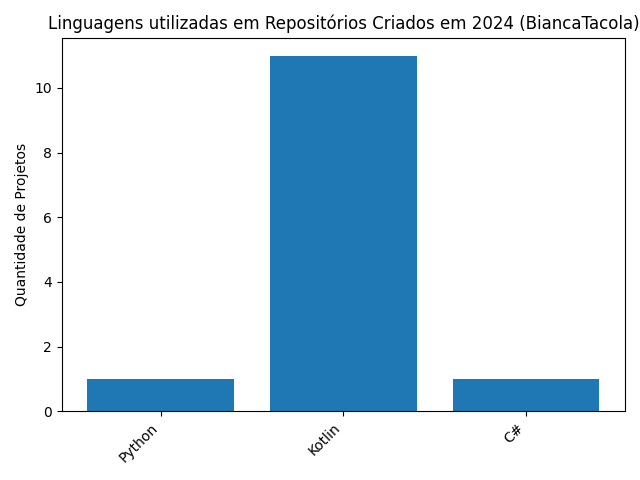

# Análise de Repositórios do GitHub (2024)
Este projeto analisa os repositórios criados no primeiro semestre de 2024, mostrando as linguagens utilizadas em cada projeto.
## Como Executar o Script
1. Certifique-se de ter o Python 3 instalado.
2. Instale as dependências com `pip install requests matplotlib`.
3. Execute o script com o comando `python analise_github.py`.
O gráfico gerado será salvo como um arquivo de imagem no diretório especificado.

